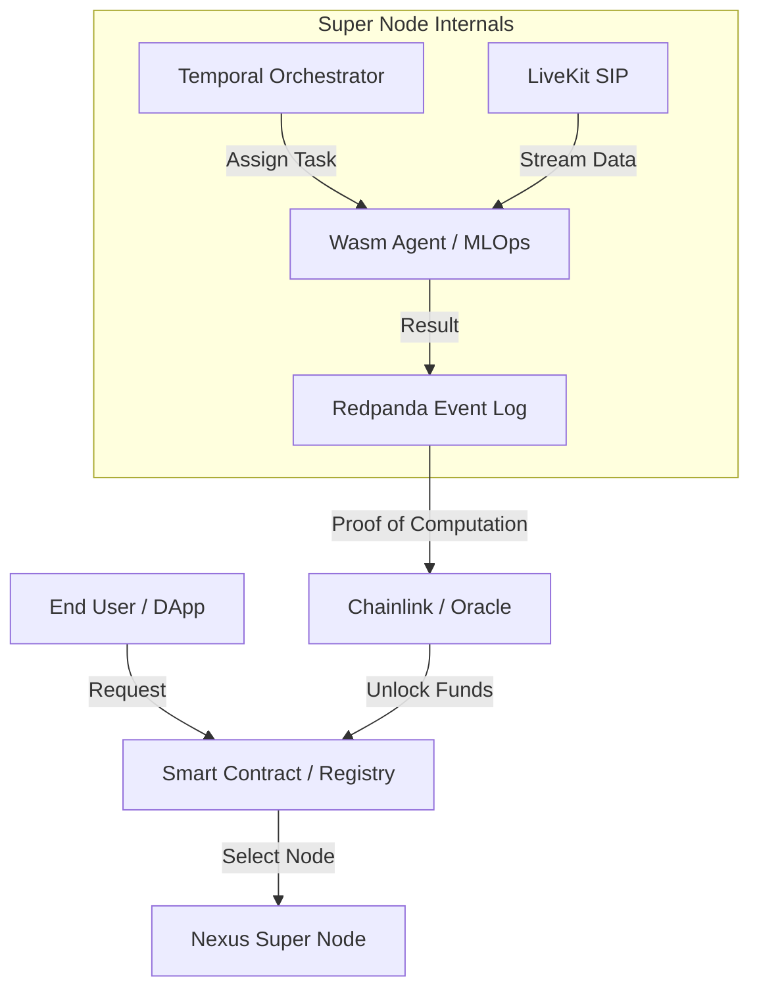

# Decentralized PIN (DPIN) Ecosystem for Super Node
## Strategic Vision & Architecture

### 1. Ecosystem Overview
The Nexus Super Node is designed to be the backbone of a Decentralized Physical Infrastructure Network (DPIN). In this ecosystem, "nodes" are not just servers but intelligent agents capable of managing physical and digital resources (bandwidth, compute, media processing, SIP trunks) in a trustless, verifiable manner.

### 2. Core Pillars

#### A. Decentralized Orchestration (The Brain)
- **Technology**: Temporal + Go (Internal)
- **Role**: Manages complex, long-running workflows (e.g., "Provision SIP Trunk -> Transcribe Call -> Store Proof on IPFS -> Pay Node via Smart Contract").
- **Why**: Replaces centralized control with distributed, durable state machines.

#### B. Edge Intelligence & MLOps (The Workers)
- **Technology**: WebAssembly (Wasm) + Rust
- **Role**: 
  - **Wasm Agents**: Lightweight, secure sandboxes for running third-party code (MCP Servers) on the Super Node.
  - **Wasm MLOps**: Rust-based modules running inside Redpanda pipelines to filter/score training data in real-time.
- **Benefit**: "Code-to-Data". Instead of sending TBs of video/logs to the cloud, send the 2MB Wasm logic to the Super Node.
- **Verification**: Wasm execution is deterministic, enabling future Zero-Knowledge Proofs (ZKP) or TEE verification.

#### C. Connectivity & Media (The Nervous System)
- **Technology**: LiveKit + SIP (Native Bridge)
- **Role**: Ingests real-world signals (Phone calls, CCTV streams, IoT sensors) and converts them to digital streams.
- **DPIN Angle**: Nodes earn tokens for relaying high-quality media or bridging legacy Telco networks (SIP) to WebRTC.

#### D. Trust & Settlement (The Ledger)
- **Technology**: Smart Contracts (EVM/Solana) + Redpanda (Event Log)
- **Role**: 
  - **Service Discovery**: On-chain registry of available Super Nodes.
  - **Settlement**: Micro-payments for resources (e.g., per-minute SIP bridging).
  - **SLA**: Slashing penalties for downtime (verified by other nodes).

#### E. 360-Degree Communication (The Unified Interface)
- **Technology**: Matrix (Conduit) + LiveKit + OpenClaw
- **Role**: Provides a unified communication layer for users, agents, and external platforms (Telegram, WhatsApp).
- **Architecture**:
  - **Text/Channels**: Handled by Matrix (Conduit) and OpenClaw Gateway.
  - **OpenClaw**: Connects external platforms (WhatsApp, Telegram, Discord) to the Super Node's internal chat system.
  - **Real-time A/V**: Handled by LiveKit, enabling high-quality voice/video calls within chat channels.
  - **Bridge**: The Super Node acts as the glue, creating LiveKit rooms for Matrix channels and managing agent participation.
- **Benefit**: Users can build platforms with built-in "Omnichannel" support where AI Agents can participate in group chats, voice calls, and support tickets seamlessly.

#### F. Social & Content Layer (The Feed)
- **Technology**: Redpanda (Streams) + Wasm (Edge Moderation) + IPFS (Media)
- **Role**: A decentralized social feed for the DPIN ecosystem.
- **Features**:
  - **Real-time Feed**: New posts are streamed via Redpanda to connected clients (Portals).
  - **Edge Moderation**: Every post is processed by a local Wasm module (e.g., `moderation-v1.wasm`) for tagging, sentiment analysis, or filtering BEFORE being indexed.
  - **Verifiable Content**: Posts are signed by the user's DID/Wallet (future phase).
- **Why DPIN?**: Instead of a central server deciding what you see, the local Super Node (or user's own node) runs the Wasm logic to curate the feed.

#### G. Financial & Tokenization Layer (DeFi/Web3)
- **Technology**: TiDB (Main Database) + LayerZero (Cross-Chain) + Smart Contracts
- **Role**: A unified financial backbone where each user/business account is a sovereign entity capable of managing assets, equity, and loans.
- **Features**:
  - **Asset Tokenization**: Users can tokenize their business equity, utility tokens, or rewards directly on the Super Node.
  - **DeFi Primitives**: Built-in support for lending (Loans), staking (Rewards), and asset transfers.
  - **360° Web3 Finance**: A holistic view of a user's financial health, combining traditional business data (in TiDB) with on-chain assets.
  - **LayerZero Integration**: Future-proof architecture to bridge these assets across multiple blockchains (Ethereum, Solana, etc.).
- **Why TiDB?**: As a distributed SQL database, TiDB allows each Super Node to handle massive scale business data (HTAP - Hybrid Transactional/Analytical Processing) while remaining compatible with MySQL tools, making it the perfect "Bank" for the DPIN.

### 3. Proposed DPIN Roadmap

#### Phase 1: The "Soft" Launch (Current)
- **Goal**: Stable Super Node with internal orchestration and Wasm-based MLOps.
- **Tasks**:
  - Stabilize Temporal + Go integration.
  - Deploy `mlops-wasm` for autonomous data curation.
  - Enable SIP Trunking (LiveKit).
  - Basic "Proof of Work" (logs in Redpanda).

#### Phase 2: The Open Marketplace & Communication
- **Goal**: Allow third parties to deploy Agents and build communication platforms.
- **Tasks**:
  - Expose Wasm runtime as a service (Docker Wasm).
  - Implement MCP (Model Context Protocol) over Wasm.
  - **Unified Chat System**: Matrix + LiveKit integration for 360-degree communication.
  - "App Store" for Super Node capabilities.

#### Phase 3: The Network State
- **Goal**: Autonomous coordination between nodes.
- **Tasks**:
  - Inter-node communication (Nexus RPC).
  - Shared liquidity / resource pools.
  - Global mesh network for media routing.

### 4. Technical Requirements for Next Steps
1.  **Wasm Runtime Optimization**: Ensure `wasmtime` modules are highly performant for MLOps.
2.  **Identity**: Give each Super Node a DID (Decentralized Identifier) and a crypto wallet.
3.  **Metered Resources**: Implement precise CPU/RAM/Bandwidth metering in the Wasm sandbox to bill users.

### 5. Architectural Diagram (Conceptual)

