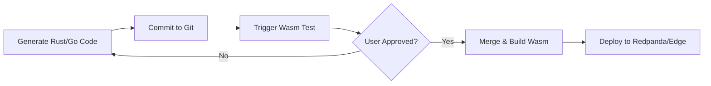

# 🏗️ Deep Analysis: GitOps & Wasm Execution Pipeline

این سند معماری کامل چرخه تولید، تست، و استقرار (CI/CD) برای ایجنت‌های تولید شده توسط Nexus Super Node را تشریح می‌کند. تمرکز اصلی بر روی **Backend Logic** و **Wasm Agents** است.

---

## 🔄 The Flow: From Prompt to Production

### 1. **Scaffolding & Generation (AI Layer)**
- **Actor:** User + VoltAgent (AI)
- **Action:** کاربر یک پرامپت می‌دهد (مثلاً "یک ربات تریدر بساز" یا "یک Reward Function برای MLOps بنویس").
- **Output:**
  - `Backend Logic` (Go/Rust) -> کد اصلی که قرار است به Wasm تبدیل شود.
  - `Configuration` (YAML/JSON) -> تنظیمات مربوط به Redpanda و Temporal.

### 2. **Version Control (Git Layer)**
- **Action:** کد تولید شده مستقیماً روی فایل‌سیستم لوکال نمی‌ماند.
- **Process:**
  1. یک **Repo** اختصاصی (یا شاخه جدید) در GitHub ساخته می‌شود.
  2. کدها کامیت و Push می‌شوند.
  3. این کار باعث می‌شود تمام تاریخچه تغییرات (Audit Trail) حفظ شود.

### 3. **Preview & Testing (Wasm Sandbox)**
قبل از اینکه کد نهایی شود، باید تست شود. در معماری بدون فرانت‌اند (Headless)، تمرکز روی منطق است:

#### Backend/Agent (Wasm Sandbox)
- **Challenge:** کدهای منطقی (Logic) باید اجرا شوند ولی نباید روی سیستم اصلی اثر مخرب بگذارند.
- **Solution:** Super Node یک بیلد سریع (Quick Build) انجام می‌دهد و کد را در یک **Wasm Runtime** ایزوله بالا می‌آورد.
- **Test:** یک سری ورودی تستی (Mock Events) از طریق Redpanda یا فراخوانی مستقیم تابع به آن داده می‌شود تا خروجی بررسی شود.

### 4. **CI/CD Pipeline (GitHub Actions)**
- **Trigger:** وقتی کاربر دکمه "Deploy" را می‌زند (Merge به main).
- **Action:** GitHub Actions فعال می‌شود.
- **Steps:**
  1. `Build`: کد Backend را به فایل `.wasm` کامپایل می‌کند (Rust: `cargo build --target wasm32-wasi`, Go: `tinygo build`).
  2. `Test`: تست‌های Unit را اجرا می‌کند.
  3. `Release`: فایل `.wasm` را به عنوان یک Release Artifact ذخیره می‌کند.

### 5. **Deployment & Execution (Super Node Runtime)**
- **Fetch:** Super Node فایل `.wasm` جدید را دانلود می‌کند.
- **Store:** در دیتابیس یا والیوم‌های Redpanda Connect (`/wasm`) ذخیره می‌شود.
- **Run:** 
  - **Redpanda Connect:** اگر یک Processor باشد، در پایپلاین داده بارگذاری می‌شود.
  - **Docker Wasm:** اگر یک Agent مستقل باشد، به عنوان یک کانتینر سبک اجرا می‌شود.
- **Isolation:** هر ایجنت در محیط سندباکس خودش اجرا می‌شود (امنیت کامل).

---

## 🛠️ Technical Components

### 1. Git Service Adapter (`internal/adapters/git`)
مسئول ارتباط با GitHub API.
- `CreateRepo(name)`
- `PushChanges(branch, files)`
- `CreatePullRequest()`

### 2. Workflow Upgrade (`AgentDeploymentWorkflow`)
تغییر از "Mock Deploy" به "Real GitOps":

### 3. Execution Engine (`internal/core/services/wasm`)
مسئول مدیریت و اجرای فایل‌های Wasm نهایی.

---

## ✅ Next Steps Implementation
1. ایجاد `GitAdapter` برای پوش کردن کدها.
2. آپدیت کردن `Workflow` برای استفاده از Git.
3. پیاده‌سازی تست‌های Wasm در محیط لوکال.
