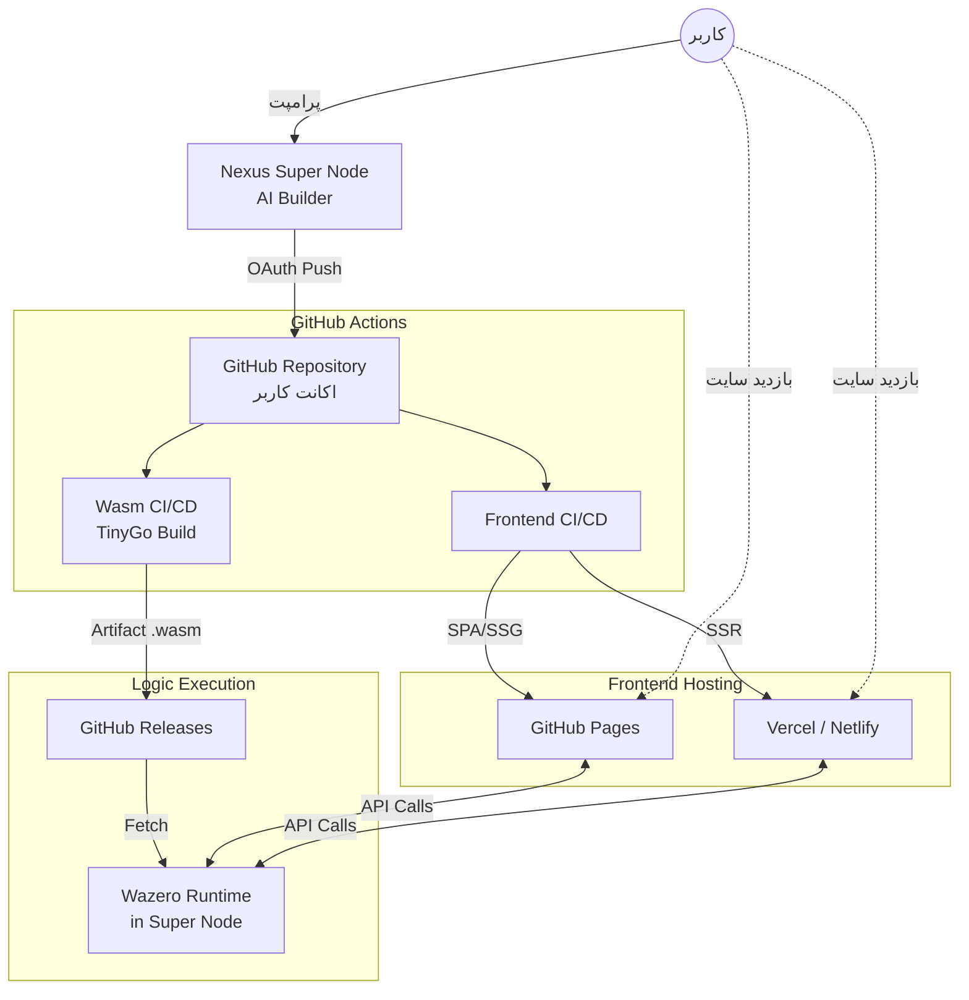

# 🏗️ Deep Analysis: User-Centric GitOps & Execution Pipeline

این سند معماری کامل چرخه تولید، تست و استقرار (CI/CD) برای برنامه‌ها و ایجنت‌های تولید شده توسط Nexus Super Node را تشریح می‌کند. 
تمرکز اصلی بر **غیرمتمرکز بودن فرآیند بیلد و دیپلوی** است، به طوری که همه چیز روی **اکانت GitHub خود کاربر** هندل می‌شود.

---

## 🏛️ استراتژی کلان دیپلوی (Deployment Strategy)

برای کاهش بار روی Super Node و دادن مالکیت ۱۰۰٪ به کاربر، سیستم از قوانین زیر پیروی می‌کند:

### ۱. استراتژی فرانت‌اند (Frontend)
فرانت‌اند تولید شده (عموماً با SvelteKit) بر اساس نیاز کاربر به یکی از دو روش زیر دیپلوی می‌شود:
*   **روش SPA/SSG (پیش‌فرض):** اگر برنامه نیاز به رندر سمت سرور نداشته باشد، به صورت Static Site Generation بیلد شده و مستقیماً روی **GitHub Pages** اکانت کاربر دیپلوی می‌شود (کاملاً رایگان و پایدار).
*   **روش SSR (پیشرفته):** اگر برنامه نیاز به Server-Side Rendering داشته باشد، سورس‌کد در ریپازیتوری کاربر پوش شده و از طریق GitHub Actions به پلتفرم‌هایی مثل **Vercel** یا **Netlify** متصل و دیپلوی می‌شود.

### ۲. استراتژی بک‌اند و منطق (Backend / Logic)
*   **زبان و ران‌تایم:** تمام بیزینس لاجیک‌ها و عامل‌ها (Agents) با زبان **Go** نوشته شده و توسط **TinyGo** به ماژول‌های سبک WebAssembly (`.wasm`) کامپایل می‌شوند.
*   **مکان بیلد:** کامپایل کدهای Go به Wasm روی سرورهای ابری Nexus انجام نمی‌شود، بلکه توسط **GitHub Actions در اکانت خود کاربر** انجام می‌گیرد.

---

## 🔄 The Flow: From Prompt to Production

### 1. **Scaffolding & Generation (AI Layer)**
- **Actor:** User + App Builder Agent
- **Action:** کاربر یک پرامپت می‌دهد (مثلاً "یک فروشگاه آنلاین بساز با یک ربات تریدر").
- **Output:**
  - `Frontend Code` (SvelteKit) -> کدهای رابط کاربری (پیکربندی شده برای آداپتور Static یا Vercel).
  - `Backend Logic` (Go/TinyGo) -> منطق تجاری و عامل‌ها.
  - `GitHub Actions Workflows` (`.github/workflows/`) -> فایل‌های CI/CD تولید شده توسط AI.

### 2. **Version Control (User's GitHub Account)**
- **Action:** Nexus Super Node از طریق OAuth (با اجازه کاربر) به GitHub او متصل می‌شود.
- **Process:**
  1. یک **Repo** جدید در اکانت GitHub کاربر ساخته می‌شود.
  2. تمام کدهای فرانت‌اند، بک‌اند و فایل‌های Workflow کامیت و Push می‌شوند.
  3. این کار باعث می‌شود کاربر مالکیت کامل (Full Ownership) سورس‌کد را داشته باشد.

### 3. **CI/CD Pipeline (GitHub Actions)**
به محض پوش شدن کد، GitHub Actions در ریپازیتوری کاربر فعال می‌شود. این پایپلاین دو وظیفه موازی دارد:

#### 🅰️ Pipeline فرانت‌اند (UI)
- `Build`: کدهای SvelteKit را بیلد می‌کند.
- `Deploy`:
  - اگر استراتژی SSG باشد: پوشه `build` را به شاخه `gh-pages` منتقل می‌کند تا سایت بالا بیاید.
  - اگر استراتژی SSR باشد: از طریق توکن کاربر، بیلد را به Vercel یا Netlify ارسال می‌کند.

#### 🅱️ Pipeline بک‌اند (Wasm Logic)
- `Setup`: محیط TinyGo را در GitHub Actions نصب می‌کند.
- `Build`: کدهای Go را به فایل `.wasm` کامپایل می‌کند (`tinygo build -o agent.wasm -target=wasi`).
- `Release`: فایل `.wasm` را در بخش GitHub Releases قرار می‌دهد یا آن را در IPFS پین می‌کند.

### 4. **Execution (Super Node Runtime)**
پس از پایان موفقیت‌آمیز GitHub Actions، پلتفرم Nexus وارد عمل می‌شود:
- **Fetch:** فایل `.wasm` بیلد شده را از GitHub Releases اکانت کاربر دانلود می‌کند.
- **Run:** فایل Wasm در محیط ایزوله **Wazero** (داخل Super Node) بارگذاری و اجرا می‌شود.
- **Connect:** فرانت‌اند دیپلوی شده (در GitHub Pages/Vercel) حالا می‌تواند از طریق API با Wasm Agent در حال اجرا روی Super Node ارتباط برقرار کند.

---

## 🛠️ Workflow Architecture

نمای گرافیکی این جریان کاری غیرمتمرکز:

---

## ✅ مزایای این رویکرد (چرا اکانت کاربر؟)
1. **هزینه صفر برای Nexus (Zero Compute Cost):** سرورهای ما درگیر بیلد کردن پروژه‌های سنگین Svelte یا کامپایل Wasm نمی‌شوند. همه چیز از منابع رایگان GitHub Actions کاربر استفاده می‌کند.
2. **شفافیت و مالکیت (Transparency):** کاربر دقیقاً می‌بیند چه کدی تولید شده و مالکیت سورس‌کد و زیرساخت میزبانی فرانت‌اند با خود اوست.
3. **انعطاف‌پذیری:** اگر کاربر بخواهد سایت را تغییر دهد، نیازی به سیستم ما ندارد؛ مستقیماً روی گیت‌هاب خودش تغییرات را می‌دهد و پایپلاین به صورت خودکار اجرا می‌شود.
