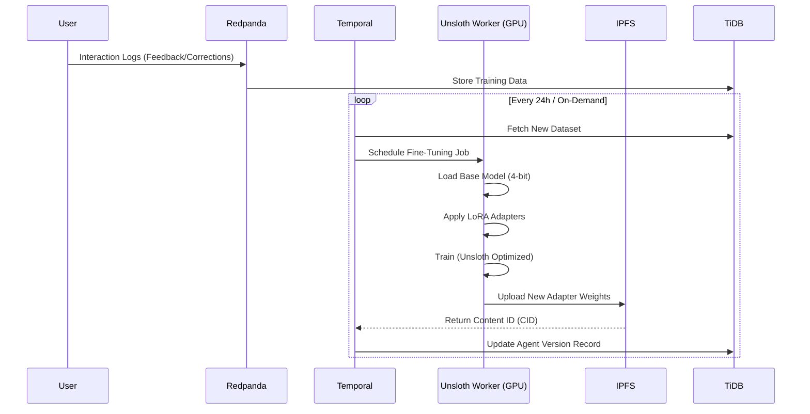

# AI Model Training with Unsloth

This document details how the Nexus Super Node utilizes **Unsloth** for high-performance, memory-efficient fine-tuning of Large Language Models (LLMs). We leverage **LoRA (Low-Rank Adaptation)** and **QLoRA (Quantized LoRA)** to enable decentralized training on consumer-grade GPUs.

## Why Unsloth?

[Unsloth](https://github.com/unslothai/unsloth) is an optimized training framework that provides:
- **2x-5x Faster Training**: Custom kernels for backpropagation.
- **70% Less Memory Usage**: Enables fine-tuning Llama-3 8B on a single T4 or RTX 3060.
- **0% Accuracy Loss**: Mathematically equivalent to Hugging Face's implementation.

In the Nexus ecosystem, Unsloth allows us to democratize model training. Instead of needing massive H100 clusters, individual Node Operators can contribute to training specialized agents using their local GPUs.

## Core Concepts: LoRA & QLoRA

To make training feasible on distributed nodes, we do not retrain full models. We use parameter-efficient fine-tuning (PEFT).

### LoRA (Low-Rank Adaptation)
Instead of updating all billions of parameters in a model, LoRA freezes the pre-trained model weights and injects trainable rank decomposition matrices into each layer of the Transformer architecture.
- **Benefit**: Drastically reduces the number of trainable parameters (often < 1% of the original).
- **Result**: Tiny adapter files (10MB - 100MB) that can be easily distributed via IPFS, rather than multi-gigabyte full models.

### QLoRA (Quantized LoRA)
QLoRA takes efficiency a step further by backpropagating gradients through a frozen, 4-bit quantized pretrained model into Low Rank Adapters.
- **Benefit**: Reduces memory footprint significantly, allowing larger models to fit in smaller VRAM.
- **Nexus Use Case**: Enabling 70B+ parameter models to be fine-tuned on mid-range hardware.

## The Training Pipeline

The training process is fully automated and orchestrated by **Temporal**.



## Job Structure

A fine-tuning job is triggered via the Nexus Internal API.

### Request Payload
```json
{
  "job_id": "ft-12345",
  "agent_id": "agent-sales-v2",
  "base_model": "unsloth/llama-3-8b-bnb-4bit",
  "dataset_query": "SELECT prompt, response FROM interactions WHERE rating > 4",
  "parameters": {
    "r": 16,
    "lora_alpha": 16,
    "target_modules": ["q_proj", "k_proj", "v_proj", "o_proj"],
    "lora_dropout": 0,
    "bias": "none",
    "use_gradient_checkpointing": true,
    "random_state": 3407,
    "max_seq_length": 2048
  }
}
```

## Dataset Format

Nexus standardizes training data into the **Alpaca** or **ShareGPT** formats.

**Example (Alpaca):**
```json
[
  {
    "instruction": "Summarize the user's request.",
    "input": "I need a decentralized storage solution that supports S3 compatible API...",
    "output": "The user is looking for a decentralized object storage system with S3 compatibility, such as MinIO running on top of IPFS or Filecoin."
  }
]
```

## GPU Resource Management

The **Nexus Scheduler** assigns jobs based on VRAM availability.

| Model Size | Method | Min VRAM Required | Recommended GPU |
| :--- | :--- | :--- | :--- |
| **Llama-3 8B** | QLoRA (4-bit) | ~6 GB | RTX 3060 / RTX 4060 |
| **Llama-3 70B** | QLoRA (4-bit) | ~24 GB | RTX 3090 / RTX 4090 |
| **Mistral 7B** | LoRA (16-bit) | ~16 GB | RTX 4080 / A4000 |

## Integration Steps for Developers

To add a new specialized training recipe:

1.  **Define the Dataset**: Create a SQL view in TiDB that aggregates high-quality user interactions.
2.  **Configure the Agent**: Update the Agent Manifest to point to the new dataset source.
3.  **Submit Job**: Use the Admin RPC to trigger a manual training run or wait for the automated schedule.
4.  **Verification**: Once trained, the Super Node will spin up a test instance with the new Adapter (loaded from IPFS) to run validation benchmarks before promoting it to production.
