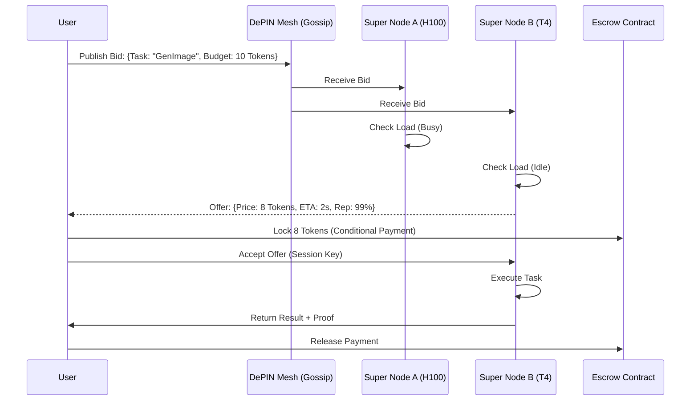

# Nexus DePIN Economics: The Compute Auction

This document defines the economic protocol governing the Nexus DePIN. It explains how resources (Compute, Bandwidth, Storage) are priced, allocated, and settled using a real-time auction mechanism.

## 1. The Core Problem
In a decentralized network, nodes have varying capabilities (H100 GPUs vs. Raspberry Pis). Users have varying needs (Real-time inference vs. Batch processing).
**The Auction Protocol** matches these efficiently without a central coordinator.

## 2. The Real-Time Compute Auction (RTCA)

Every task execution request acts as a "Bid" in the marketplace.

### The Flow
1.  **Bid Generation**:
    -   User/Agent submits a request: `Execute(Task="Llama3-8b-Inference", MaxPrice=0.005 USDC, Latency<200ms)`.
2.  **Gossip Propagation**:
    -   The request is broadcasted to the Super Node mesh via **GossipSub** topic `auction.compute`.
3.  **Solver Matching (The Super Node Role)**:
    -   Super Nodes act as "Solvers". They check their local resource availability (or their connected Edge Nodes).
    -   If a node has idle GPU capacity matching the requirements, it signs a **"Commitment"**.
4.  **Selection**:
    -   The user's client (or their Gateway) selects the best Commitment (lowest price or best reputation).
5.  **Execution & Settlement**:
    -   The task is executed.
    -   A **Probabilistic Micropayment** (Taproot/Lightning-style) is locked.
    -   Upon verification of the result (Proof of Computation), the payment is released.

## 3. Staking & Slashing (Trust Layer)

To prevent malicious behavior (returning garbage data), nodes must stake tokens.

-   **Minimum Stake**: A Super Node must stake 100,000 NEX to participate in the routing layer.
-   **Slashing Conditions**:
    -   **Downtime**: Failing to respond to accepted tasks (>5% failure rate).
    -   **Incorrect Compute**: Returning a result hash that mismatches the consensus verification (Verification by Replication).
    -   **Sybil Attack**: Spamming the DHT with fake peers.

## 4. Resource Pricing Curves

Pricing is dynamic, based on network congestion (similar to EIP-1559).

-   **Base Fee**: Determined by global network utilization.
-   **Priority Fee**: Users can tip to jump the queue.
-   **Spot Instances**: Nodes can offer "Spot" pricing for interruptible batch jobs (e.g., AI model fine-tuning) at ~80% discount.

## 5. Token Utility (NEX)

1.  **Medium of Exchange**: Paying for Compute/Storage.
2.  **Work Token**: Right to perform work (Staking).
3.  **Governance**: Voting on protocol parameters (e.g., Slashing rates).
