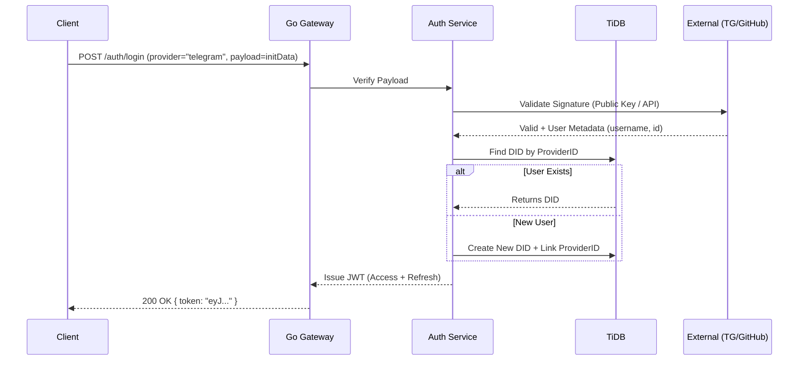
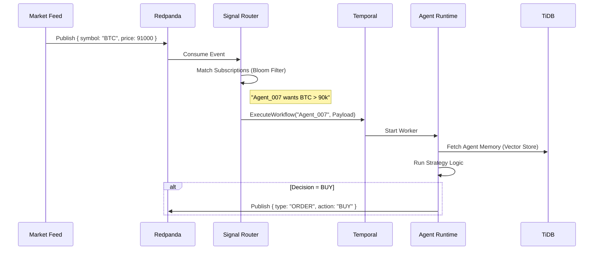
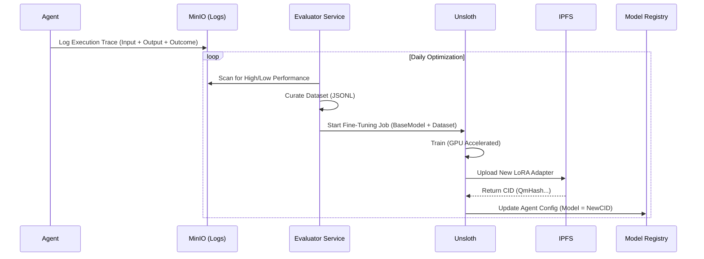

# System Data Flows & Lifecycles

This document details the critical data paths within the Nexus Super Node. It covers how users authenticate, how agents react to the world, and how the system learns from its mistakes.

## 1. Authentication & Identity Federation
*How we bridge Web2 (Telegram/GitHub) and Web3 (Wallets) into a single identity.*

The Nexus Super Node uses a **Federated Identity Model**. A single user ID (DID) can be linked to multiple authentication providers.

### The Auth Sequence
1.  **Challenge Generation**: Client requests a login challenge (nonce).
2.  **Signing**:
    -   **Web3**: User signs the nonce with their Private Key (MetaMask/Phantom).
    -   **Telegram**: The Mini App provides `initData` signed by Telegram's bot token.
    -   **GitHub**: OAuth exchange provides a valid Access Token.
3.  **Verification**: The Super Node verifies the signature/token against the provider.
4.  **Session Creation**:
    -   If valid, the system looks up the `UserDID` in TiDB.
    -   A JWT is issued with claims: `sub: DID`, `roles: [pro, dev]`, `scope: [read:market, write:agent]`.

---

## 2. Agent Awakening (The "Hot" Path)
*From Market Signal to Wasm Execution in milliseconds.*

This is the core loop. We do **not** poll the database. We react to events.

### The Trigger Chain
1.  **Ingestion**: Market data flows into Redpanda topics (`market.btc.usd`).
2.  **Filtering**: The **Signal Router** (in Go) reads the stream. It checks: *"Which agents are subscribed to BTC > 90k?"*
3.  **Orchestration**: If a condition matches, a Temporal Workflow is triggered.
4.  **Execution**: Temporal spins up a Wasm worker, injects the context, and runs the agent's logic.

---

## 3. The AI Training Loop (The "Cold" Path)
*How the system gets smarter over time.*

Agents produce logs and outcomes. If an agent loses money or fails a task, we don't just log it; we use it as a negative training example.

### The Optimization Pipeline
1.  **Data Collection**: All agent decisions are logged to MinIO (via Redpanda Connect).
2.  **Evaluation**: A daily cron job (or real-time trigger) scores agent performance.
3.  **Fine-Tuning**:
    -   High-performing traces become "Golden Datasets".
    -   **Unsloth** is triggered to fine-tune the base SLM (Small Language Model) with these new examples.
4.  **Deployment**: The new model weights (LoRA adapter) are saved to IPFS and hot-swapped into the running agents.

