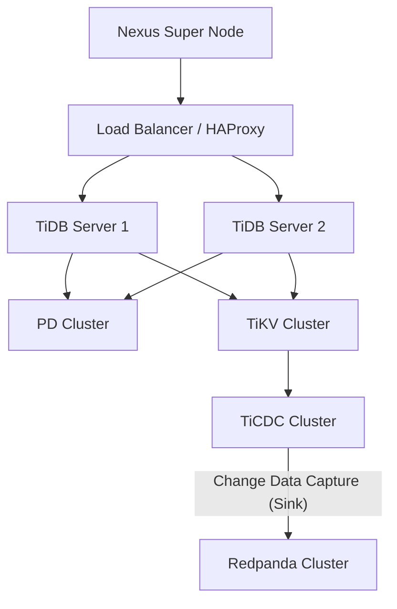

# Infrastructure Deep Dive & Analysis (V2)

## 1. TiDB Cluster & Sink Architecture

### Current Status
- **Connection**: Single DSN (`root:@tcp(localhost:4001)/nexus`).
- **Migration**: Auto-migration on startup.
- **Topology**: Single instance (development mode).

### Recommended Production Architecture



#### Key Improvements:
1.  **High Availability (HA)**: Use a Load Balancer (AWS NLB, HAProxy, or K8s Service) in front of multiple TiDB stateless SQL nodes.
2.  **TiCDC for Sinking**: Instead of dual-writing to Redpanda from code (which is prone to inconsistency), use **TiCDC** to capture database changes and stream them to Redpanda topics (e.g., `tidb_nexus_users`).
    - **Why?** Guarantees eventual consistency. If the app writes to DB but crashes before sending to Redpanda, TiCDC ensures the event still arrives.
    - **Configuration**:
      ```bash
      tiup cdc cli changefeed create --sink-uri="kafka://redpanda-1:9092/tidb_topic?protocol=canal-json" --changefeed-id="nexus-feed"
      ```

## 2. Service Decoupling & Scaling Strategy

The **Go Backend** (located in `cmd/nexus-super-node`) is the core of the system. We have refactored `main.go` to support Role-Based Execution. This allows independent scaling of components using the same Go binary.

### Roles Definition (Go Backend)

| Role | Responsibility | Scaling Metric | Statefulness |
| :--- | :--- | :--- | :--- |
| **`api`** | HTTP/WebSocket Gateway, Chat Service, Auth | CPU / Request Count | Stateless (Session in Redis/JWT) |
| **`worker`** | Temporal Activities, Wasm Execution, AI Processing (**VoltAgent Embedded**) | Queue Depth (Temporal) | Stateless (Idempotent execution) |
| **`consumer`** | Redpanda Stream Processing, Market Analysis | Lag (Consumer Group) | Stateless (Offset in Redpanda) |
| **`monolith`** | All of the above (Dev / Low traffic) | N/A | Mixed |

### Sidecar Services & Connectors Integration

Beyond the core roles, the Super Node relies on specialized sidecars for specific capabilities. These are deployed in the **Infrastructure Layer**.

| Service | Type | Layer | Description |
| :--- | :--- | :--- | :--- |
| **Hasura** | GraphQL | Infra | Instant GraphQL API on Postgres. Used for frontend data access. |
| **Rivet Service** | gRPC Server | Infra | Visual Programming Engine for AI agents. Accessible by all roles via `RIVET_SERVICE_URL`. |
| **OpenClaw** | Gateway | Infra | Multi-channel messaging gateway (Matrix, Telegram, etc.). Used by API/Worker to push messages. |
| **Redpanda Connect** | ETL / Stream | Infra | (Formerly Benthos) Stateless stream processor for transforming data between Redpanda topics. |
| **Wasm Agent** | Runtime | Infra | Dedicated node for executing untrusted Wasm modules (if not running embedded in Worker). |
| **VoltAgent** | **Embedded** | App | **Not a separate container.** It runs inside the `nexus-worker` process as a Go module. |
| **LiveKit** | Media Server | Infra | Real-time audio/video transport with **SIP Bridge**. |

### Deployment Strategy (Kubernetes / Docker Swarm)

#### 1. API Deployment
- **Replicas**: 3+
- **Env**: `NEXUS_ROLE=api`
- **Ingress**: Public HTTP/WS traffic.

#### 2. Worker Deployment
- **Replicas**: Auto-scaled based on Temporal Task Queue backlog.
- **Env**: `NEXUS_ROLE=worker`
- **Resources**: High CPU/Memory (for AI/Wasm).

#### 3. Consumer Deployment
- **Replicas**: Matches Redpanda Partition count (e.g., 3-10).
- **Env**: `NEXUS_ROLE=consumer`
- **Resources**: Network I/O optimized.

### Diagram: Super Node Distributed Topology

```mermaid
graph LR
    User[User/Client] --> LB[Load Balancer]
    
    subgraph "API Layer (NEXUS_ROLE=api)"
        API1[Node 1]
        API2[Node 2]
    end
    
    subgraph "Async Processing"
        Worker1[Worker Node (AI/Wasm)]
        Worker2[Worker Node (AI/Wasm)]
        Consumer1[Market Consumer]
    end
    
    subgraph "Data Plane"
        TiDB[(TiDB Cluster)]
        Redpanda{Redpanda Cluster}
        Temporal{Temporal Cluster}
    end
    
    LB --> API1 & API2
    API1 & API2 --> TiDB
    API1 & API2 --> Temporal
    API1 & API2 --> Redpanda
    
    Consumer1 -- "Consume" --> Redpanda
    Consumer1 -- "Trigger" --> Temporal
    
    Temporal -- "Dispatch" --> Worker1 & Worker2
    Worker1 & Worker2 -- "Persist" --> TiDB
```

## 3. Dedicated Infrastructure Node Composition

For large-scale deployments, infrastructure services should be isolated on dedicated nodes to prevent resource contention.

### Node Type A: Data Persistence Node (TiDB + Storage)
*   **Services**: TiKV (Storage Engine), PD (Placement Driver).
*   **Hardware**: High IOPS NVMe SSDs, High RAM (caching).
*   **Why Separate?**: Database disk I/O should not compete with Kafka/Redpanda logging.

### Node Type B: Event Streaming Node (Redpanda)
*   **Services**: Redpanda Broker.
*   **Hardware**: High Throughput Network (10Gbps+), Sequential Write optimized Disks (XFS).
*   **Why Separate?**: Redpanda is CPU efficient but Network/Disk intensive.

### Node Type C: Orchestration Node (Temporal)
*   **Services**: Temporal Server (Frontend, History, Matching, Worker), Cassandra/Postgres (if not using TiDB/Redpanda as backend).
*   **Hardware**: Balanced CPU/RAM.
*   **Why Separate?**: Temporal History service can be heavy on database writes.

### Node Type D: Real-time Comms Node (LiveKit/Matrix)
*   **Services**: 
    *   **LiveKit Server**: Real-time audio/video.
    *   **SIP**: LiveKit SIP Bridge for telephony integration.
    *   **Matrix Homeserver (Conduit)**: Chat/Collaboration.
*   **Hardware**: High Bandwidth, Low Latency Network.
*   **Why Separate?**: UDP traffic for WebRTC is sensitive to latency jitter caused by heavy batch processing.

### Node Type E: AI & Connectors Node (Sidecars)
*   **Services**:
    *   **Hasura**: Instant GraphQL API over Postgres.
    *   **Rivet Service**: For visual AI programming.
    *   **OpenClaw**: For multi-channel messaging (Telegram/Matrix bridge).
    *   **Redpanda Connect**: For data ingestion and transformation.
    *   **Wasm Agent**: For executing untrusted code at the edge.
*   **Hardware**: General purpose.
*   **Why Separate?**: These are stateless services that act as "plugins" to the main architecture. Isolating them simplifies updates and scaling without redeploying the core logic.

## 4. Multi-Region / Edge Strategy

If scaling geographically:

1.  **Global Control Plane**: Temporal & TiDB (PD) in the central region.
2.  **Edge Compute**:
    -   Run `api` nodes close to users.
    -   Run `worker` nodes where data/compute is needed.
3.  **Data Replication**:
    -   Use TiDB `Follower Read` for low-latency reads at edge.
    -   Use Redpanda `Remote Read Replicas` (Tiered Storage) for edge consumption.

## 5. Practical Configuration (Docker Compose Split)

We have created two Docker Compose files to simulate this distributed environment:

### Step 1: Start Infrastructure Layer
This runs TiDB, Redpanda, Redis, Temporal, etc. on a dedicated network.

```bash
docker-compose -f docker-compose.infra.yml up -d
```

### Step 2: Start Application Layer (Go Backend)
This runs the compiled Go binary (`nexus-super-node`) in 3 separate roles (`api`, `worker`, `consumer`), connecting to the infrastructure layer.

```bash
# Option A: Run as Distributed Microservices (Recommended for Production)
docker-compose -f docker-compose.app.yml up --build

# Option B: Run as Monolith (Recommended for Dev/Testing)
# Runs a single container that does everything (API + Worker + Consumer)
docker-compose -f docker-compose.app.yml --profile monolith up --build
```

**Note on Networking**:
- Both files share the `nexus-net` network.
- `docker-compose.app.yml` uses environment variables (e.g., `NEXUS_TIDB_DSN`, `TEMPORAL_HOST_PORT`) to point to the service names defined in `docker-compose.infra.yml`.

### Step 3: Scaling
You can now scale individual components:

```bash
# Scale up workers to handle more AI tasks
docker-compose -f docker-compose.app.yml up -d --scale nexus-worker=5

# Scale up consumers to handle more market data
docker-compose -f docker-compose.app.yml up -d --scale nexus-consumer=3
```

## 6. Future Roadmap: Distributed Edge Computing with wasmCloud

While the current architecture uses `wazero` for efficient, in-process Wasm execution within the Super Node, we plan to expand to a fully distributed edge model using **wasmCloud**.

### Why wasmCloud?
*   **Location Transparency**: Run actors (Wasm modules) anywhere (Cloud, Edge, IoT, Browser) without code changes.
*   **Lattice Network**: A flat topology where any component can talk to any capability provider, regardless of physical location.
*   **Security**: Zero Trust architecture by default.

### Planned Integration
1.  **Hybrid Runtime**:
    *   **Core (Super Node)**: Continues to use `wazero` for high-performance, synchronous, and local tasks.
    *   **Edge (IoT/Remote)**: Deploys `wasmCloud Host` on remote devices.
2.  **Control Plane**:
    *   The Super Node will act as the **Lattice Controller**, dispatching AI/Compute tasks to edge nodes via NATS (wasmCloud's transport).
3.  **Use Cases**:
    *   Running privacy-preserving AI inference on user devices.
    *   Processing industrial IoT sensor data at the source before sending summaries to the Super Node.
