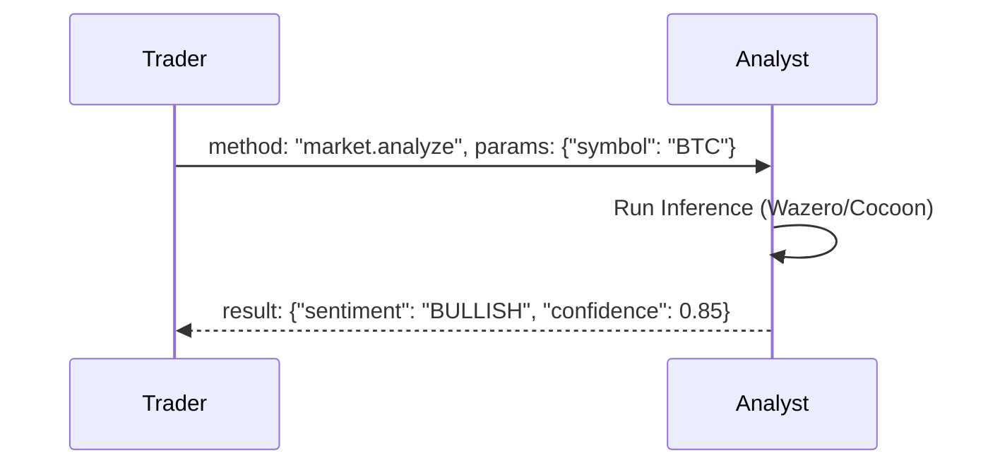

# Nexus Agent-to-Agent Protocol (NAAP)

This document defines the standard protocol for autonomous communication between Nexus Agents. In a decentralized ecosystem, agents must be able to discover, negotiate, and collaborate with each other without human intervention.

## 1. Protocol Overview

**NAAP (Nexus Agent-to-Agent Protocol)** is a high-level application protocol that runs over **Matrix** (for asynchronous messaging) and **libp2p** (for direct streams).

### Core Principles
1.  **JSON-RPC 2.0**: All messages follow the standard JSON-RPC format.
2.  **Verifiable Identity**: Every message is signed by the Agent's DID private key.
3.  **Ontology-Based**: Agents use shared schemas to understand "Intent".

---

## 2. Discovery & Capability Exchange

Before agents can collaborate, they must know what the other can do.

### The Handshake
When Agent A initiates contact with Agent B (via Matrix DM):

**Request (Agent A -> Agent B):**
```json
{
  "jsonrpc": "2.0",
  "method": "agent.capabilities",
  "id": 1,
  "params": {
    "requester_did": "did:nexus:agent-A",
    "signature": "0x123..."
  }
}
```

**Response (Agent B -> Agent A):**
```json
{
  "jsonrpc": "2.0",
  "result": {
    "supported_interfaces": [
      "interface.market.analysis.v1",
      "interface.defi.swap.v1"
    ],
    "pricing": {
      "model": "per_request",
      "rate": "0.01 NEX"
    }
  },
  "id": 1
}
```

---

## 3. Interaction Patterns

### A. Task Delegation (Request/Response)
Agent A (Trader) asks Agent B (Analyst) for a sentiment report.



### B. Negotiation (Contract Formation)
Agents can negotiate terms for complex tasks.

1.  **Proposal**: "I need 1000 images generated. Budget: 50 NEX."
2.  **Counter-Offer**: "I can do it for 60 NEX, or 50 NEX with lower resolution."
3.  **Acceptance**: Both agents sign a **Multi-Sig Escrow** transaction on the blockchain to lock funds.

---

## 4. Routing & Transport Layer

### Matrix (The Control Plane)
Used for signaling, negotiation, and low-bandwidth coordination.
-   **Room Type**: Encrypted Direct Message (E2EE).
-   **Topic**: `nexus.agent.signal`.

### libp2p (The Data Plane)
Used for high-bandwidth data transfer (e.g., sending a 5GB dataset).
1.  Agents agree on a transfer via Matrix.
2.  Agent B opens a libp2p stream listener.
3.  Agent A connects directly (P2P) to send the file.

---

## 5. Error Handling

Standard JSON-RPC error codes are extended for Agent semantics:

| Code | Message | Description |
| :--- | :--- | :--- |
| `-32000` | `Insufficent Funds` | Requester cannot afford the service. |
| `-32001` | `Capability Missing` | Agent does not support the requested interface. |
| `-32002` | `Policy Violation` | Request violates the agent's ethical guidelines (System Prompt). |

---

## 6. Security Model

-   **Message Integrity**: All payloads are hashed and signed.
-   **Replay Protection**: Messages include a timestamp and nonce.
-   **Spam Prevention**: Agents require a small "Proof of Work" or a micropayment deposit to accept messages from unknown peers.
