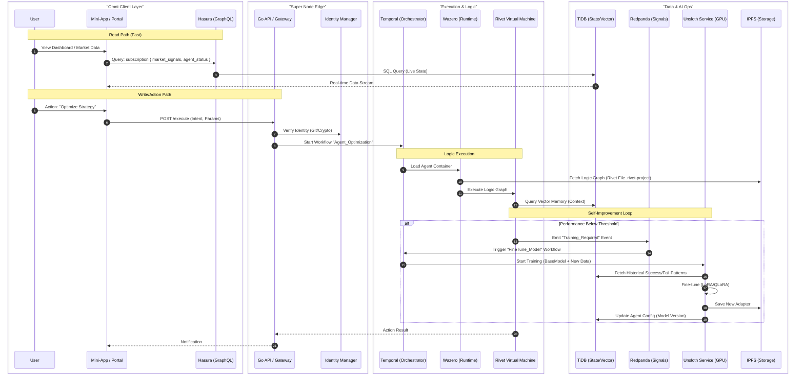

# Nexus Super Node - Architecture V2

This document contains updated architectural diagrams incorporating **Hasura** (Data Access), **Unsloth** (Model Fine-tuning), and **Rivet** (Agent Logic).

## 1. Unified Request Flow (v2)
*Integrates Hasura for reads, Rivet for logic definition, and Unsloth for background learning.*



## 2. The "Super Node" Stack - Component Map
*Shows where every service lives and how they interconnect.*

```mermaid
graph TD
    subgraph "Frontend & Access Layer"
        Portal[Web Portal (SvelteKit)]
        TG[Telegram Mini App]
        Frames[Farcaster Frames]
        Hasura[Hasura GraphQL Engine]
        
        Portal --> Hasura
        TG --> Hasura
        Frames --> GoAPI
    end

    subgraph "Core Services (The Nexus)"
        GoAPI[Go Gateway (Echo/gRPC)]
        Temporal[Temporal Server]
        Wasm[Wazero Runtime]
        RivetVM[Rivet Logic Runner]
        
        GoAPI --> Temporal
        Temporal --> Wasm
        Wasm --> RivetVM
    end

    subgraph "Event & Signal Fabric"
        RP[Redpanda (Kafka API)]
        Connect[Redpanda Connect (Benthos)]
        
        GoAPI --> RP
        Wasm --> RP
        RP --> Connect
    end

    subgraph "Data & Memory Layer"
        Redis[Redis (Hot Cache)]
        TiDB[TiDB (HTAP - SQL + Vector)]
        MinIO[MinIO (S3 - Raw Data)]
        IPFS[IPFS (Decentralized Content)]
        
        Hasura --> TiDB
        GoAPI --> Redis
        Connect --> MinIO
        Wasm --> IPFS
    end

    subgraph "AI & Compute Plane"
        Unsloth[Unsloth AI Service]
        GPU[(NVIDIA GPUs)]
        
        Unsloth --> GPU
        Temporal --> Unsloth
        Unsloth --> MinIO
        Unsloth --> IPFS
    end

    %% Key Relationships
    RivetVM -.-> |"Executes"| IPFS
    RivetVM -.-> |"Remembers"| TiDB
    Unsloth -.-> |"Reads Training Data"| TiDB
    Unsloth -.-> |"Saves Models"| IPFS
    Hasura -.-> |"Subscribes"| RP
```

## 3. Data Hierarchy & Lifecycle
*Detailed view of how data moves from Raw to Smart to Archived.*

```mermaid
graph TD
    Input((External Signals)) --> |"Ingest"| RP[Redpanda]

    subgraph "Hot (Milliseconds)"
        RP --> |"Stream"| Redis
        Redis --> |"Sub"| Client
    end

    subgraph "Warm (Seconds)"
        RP --> |"Process"| Temporal
        Temporal --> |"Write State"| TiDB
        Hasura --> |"Read"| TiDB
    end

    subgraph "Cold (Minutes/Hours)"
        RP --> |"Batch"| MinIO[MinIO (Raw Logs)]
        MinIO --> |"ETL"| Unsloth[Unsloth Training]
        Unsloth --> |"New Model"| IPFS
    end

    subgraph "Archive (Forever)"
        IPFS --> |"Pin"| Filecoin
    end
```
