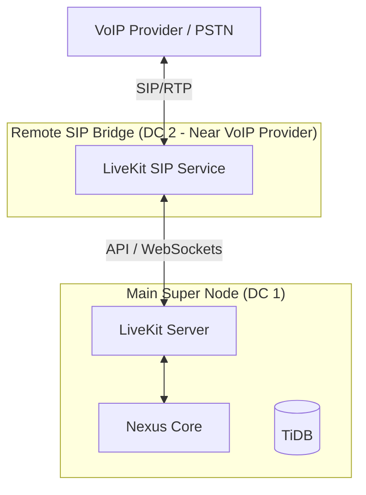

# Nexus Network Operations (NetOps)

This document details the networking layer of the Nexus DePIN, focusing on **libp2p**, **DHT**, and **Discovery**.

## 1. P2P Architecture
Nexus uses a **hybrid P2P topology**:
-   **Super Nodes**: Full DHT Servers. They maintain the map of "Who is where". High uptime, static IPs (usually).
-   **Edge Nodes**: DHT Clients behind NAT. They connect to Super Nodes via Relay V2.

### Protocol Stack
-   **Transport**: QUIC (UDP) for low latency, TCP/WebSocket for fallback.
-   **Encryption**: TLS 1.3 / Noise.
-   **Multiplexing**: Yamux.

## 2. Discovery & Routing (Kademlia DHT)

Finding a user or an agent in the decentralized web requires a robust lookup system.

### Content Routing vs. Peer Routing
1.  **Peer Routing**: "Find the IP address of Node ID `QmX...`".
2.  **Content Routing**: "Who provides the service `agent.trading.btc`?".
    -   We use the DHT to store provider records:
        -   Key: `sha256("/nexus/service/trading-agent")`
        -   Value: `[PeerID_A, PeerID_B]`

### The "Rendezvous" Pattern
Since Edge Nodes (users) are often offline or behind firewalls, they use Super Nodes as **Rendezvous Points**.
1.  User A connects to Super Node X.
2.  User A publishes a record: "I can be reached via Super Node X".
3.  When User B wants to send a message to A, they look up A in the DHT, find the relay address, and tunnel traffic through X.

## 3. GossipSub (The Nervous System)

For real-time signals (Market Data, Auctions), we use **GossipSub v1.1**.

### Topics Structure
-   `nexus/global/market`: High-volume, public market data.
-   `nexus/region/us-east/auction`: Regional compute auctions.
-   `nexus/shard/001/consensus`: Consensus messages for a specific shard.

### Spam Protection
To prevent flooding:
-   **Scoring**: Each peer is scored based on "Time in Mesh", "First Message Deliveries", and "Invalid Messages".
-   **Grafting/Pruning**: Peers with low scores are disconnected (Pruned). Peers with high scores are promoted (Grafted).

## 4. Off-Node Service Deployment (External SIP Bridge)

While the Super Node is a complete "all-in-one" stack, high-performance services like **LiveKit SIP** can (and should) be deployed on separate infrastructure for better latency and security.

### Why Deploy SIP Externally?
1.  **UDP Throughput**: VoIP (SIP/RTP) requires massive UDP throughput. A dedicated server avoids CPU contention with the Nexus Go runtime or Unsloth inference.
2.  **Public IP Binding**: SIP usually needs port `5060` (UDP/TCP). Running it on a separate VM with its own public IP simplifies NAT traversal.
3.  **Regional Presence**: You can deploy SIP bridges in London, Tokyo, and New York, all connecting back to a single Nexus Super Node's LiveKit API.

### Remote Deployment Steps
1.  **Prepare Remote VM**: Standard Ubuntu server with Docker.
2.  **Network Setup**: Open ports `5060` (SIP) and `10000-20000` (RTP range).
3.  **Configuration**:
    -   Copy `sip.yaml` to the remote server.
    -   Update the `livekit_url` in the remote `sip.yaml` to point to the Super Node's public address (e.g., `wss://supernode.com:7880`).
    -   Use the same `api_key` and `api_secret` defined in the Super Node's `livekit.yaml`.
4.  **Run**:
    ```bash
    docker run -d \
      --name livekit-sip \
      -v $(pwd)/sip.yaml:/sip.yaml \
      -p 5060:5060/udp \
      -p 5060:5060 \
      livekit/sip --config /sip.yaml
    ```



```mermaid
graph TD
    subgraph "Public Internet"
        SN1[Super Node 1 (DHT Server)]
        SN2[Super Node 2 (DHT Server)]
        SN3[Super Node 3 (DHT Server)]
    end

    subgraph "Private Network (NAT)"
        Edge1[User Laptop]
        Edge2[Raspberry Pi]
    end

    SN1 <--> |"DHT Sync"| SN2
    SN2 <--> |"Gossip"| SN3
    SN1 <--> |"Gossip"| SN3

    Edge1 -- "Relay Connection" --> SN1
    Edge2 -- "Relay Connection" --> SN3

    Edge1 -.-> |"Virtual P2P"| Edge2
```
